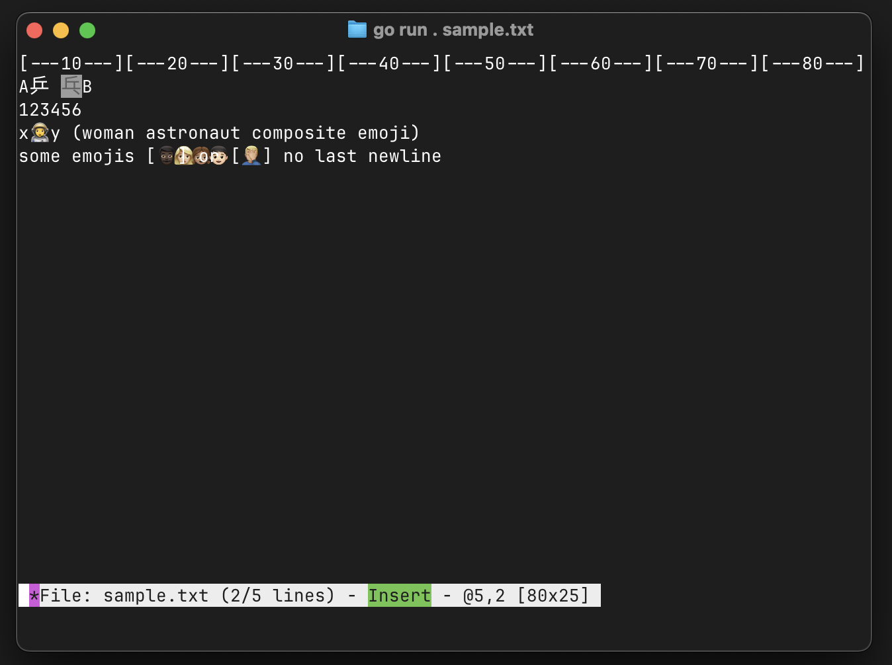

# gvi
Basic VI like editor, written in go (golang) using fortio/terminal ansipixels

It's just a bit more like "Demo of how to create something that looks/feel a like vi in a few hours" than a fully usable editor... but... it's progressing (and all the grapheme handling is actually correct unlike some others)



So far it is 760 lines of go code across 5 files (+89 lines of comments and 77 blank lines, excluding test files).

## Install

Get one of binary [releases](https://github.com/fortio/gvi/releases)

Or from go:
```sh
go install fortio.org/gvi@latest
```

Or brew:
```
brew install fortio/tap/gvi
```

Or docker:
```
docker run -ti fortio/gvi
```

## Development

For detailed development guidelines, Unicode handling, debugging instructions, and architecture documentation, see [DEVELOPMENT.md](DEVELOPMENT.md).

Quick test command:
```bash
LOGGER_LEVEL=debug go test -count 1 -v ./...
```
